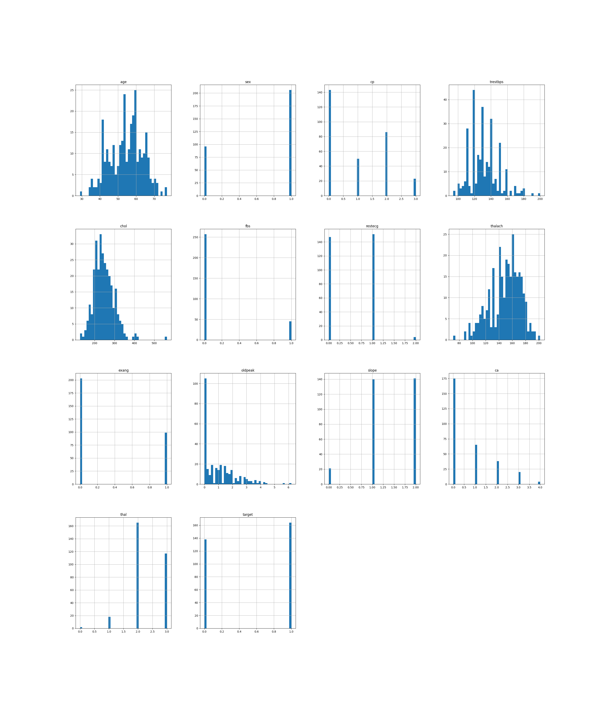
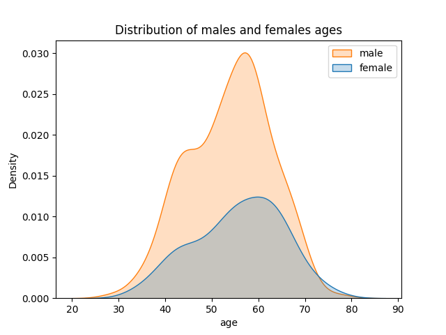
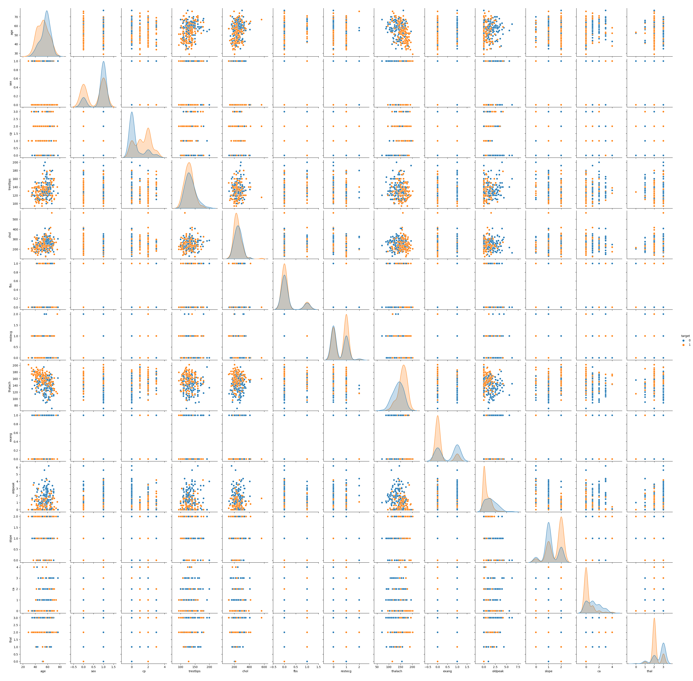

# Heart-disease-Predictive-model
## Introduction
Heart diseases are of the main causes of death nowadays and in many case we can lessen the impact of them by early detection. that created the need to a tool to predict people susceptible to hart disease so they receive extra care
## Description
Using the kaggle heart disease data set, after cleaning the data and feature engineering I create many model pipelines using different machine learning algorithms after data preparation then in the end I use ensemble model to combine all the created pipelines
## Data Exploration
The data set consists of a 14 variable and about 1025 observation
the variables are:
- age
- sex
- cp -> chest pain type (4 values)
- trestbps -> resting blood pressure
- chol -> blood cholesterol
- fbs -> fasting blood glucose
- restecg -> resting electrocardiographic results
- thalach -> maximum heart rate achieved
- exang -> exercise induced angina
- oldpeak -> ST depression induced by exercise relative to rest
- slope -> the slope of the peak exercise ST segment
- ca -> number of major vessels (0-3) colored by fluoroscopy
- thal ->  0 = normal; 1 = fixed defect; 2 = reversible defect
- target -> the presence of heart disease in the patient. It is integer valued 0 = no disease and 1 = disease.

the data were relatively clean so it did not need much cleaning

I made graph to investigate the distribution of each variable 

most of the continuos variable are normally distributed 

### There is a difference in the ages of the males and females in the study?

### What is the distribution of each variable for the healthy and diseased?

 ### What is the correlation between the each variable and the outcome?
 1[correlation-plot](graphs/corr.png)

 ## Feature engineering
 - I created new features by dividing some features over other features ( resbp/hr , Peak/slope, hr/age, bp/age )
- Converted oldpeak to log oldpeak to make it more normally distributed as some ML algorithms works best with normal data
- converted the categorical features to dummies

## Modeling
- I import most of the models and function i 
will use in the modeling of the dataL

- Split the data to train and test (80:20) stratified by the outcome to insure even distribution in the train and test sets

- Normalized the data using stander scaler

- Tried many ML algorithms (Logistic regression, SVC, Random Forest,Neural Networks, LGBM)

- I  created pipeline for each model I used 

- Used grid search to search for decent hyperparameter

- Evaluate each model (best model from the grid search) using classification report

- Created Ensemble model contains all the model I Tested before

most algorithms were around 85% accuracy and similar F1-score and after combining them in the ensemble model the accuracy and f1 score increased to 87%
